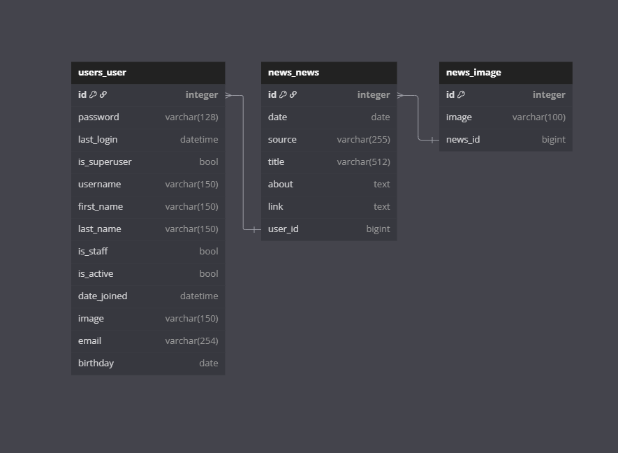

# samson_test_task

Задание для стажировки в компанию Samson

> [!WARNING]
> подрузамеввается что все действия будут воспроизводиться из корня папки

## Клонирование

```cmd
git clone https://github.com/nais2008/samson_test_task
cd ./samson_test_task/
```

## Установка виртуального окружения

```cmd
python3 -m venv venv
source ./venv/Scripts/activate
```

## Установка зависимостей

### Для выпуска

```cmd
pip3 install -r ./requirements/prod.txt
```

### Для разработки

```cmd
pip3 install -r ./requirements/dev.txt
```

### Для тестирования

```cmd
pip3 install -r ./requirements/test.txt
```

## Заполняем переменные окружения

### Создаем файл

```cmd
touch .env
```

### Заполняем

```env
# Секретный ключ, должен быть индивидуален и засекерчен
DJANGO_SECRET_KEY=your_secret_key
# Включение DEBUG для приложения
DJANGO_DEBUG=false
DJANGO_ALLOWED_HOSTS=127.0.0.1,localhost
# Активирован ли аккаунт пользователя после регистрации
DJANGO_DEFAULT_USER_IS_ACTIVE=false
# Почта для отправки сообщения, но они отправляются пока локально и появляются в папке
DJANGO_MAIL=your_mail@mail.mail
```

## Создание суперпользователя

```cmd
cd ./samson/
python3 manage.py createsuperuser
```

## Загрузка фикстур

```cmd
cd ./samson/
python3 manage.py loaddata fixtures/data.json
```

## Создание переводов

```cmd
cd ./samson/
django-admin compilemessages --ignore=venv
```

## Запуск проекта

```cmd
cd ./samson/
python3 manage.py runserver
```

## Запуск тестов

```cmd
cd ./samson/
python3 manage.py test
```

## Запуск миграций в базе данных

```cmd
cd ./samson/
python3 manage.py migrate
```

## DataBase



## Я старался, рад буду если прочитали)


